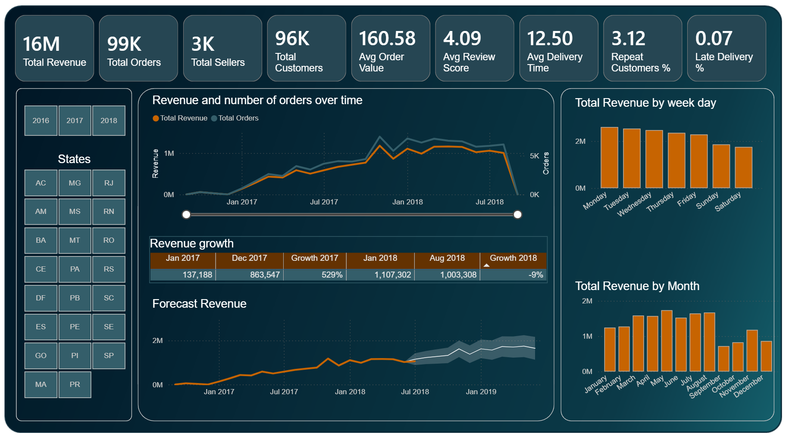
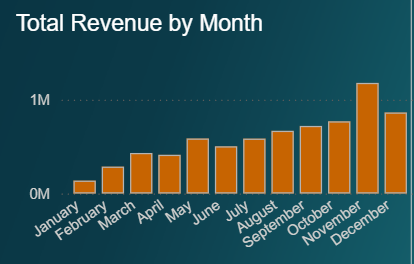
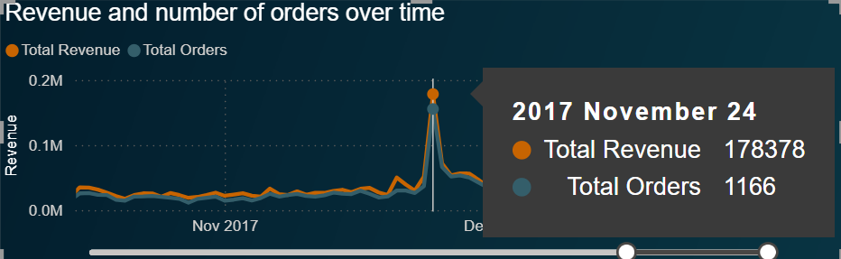
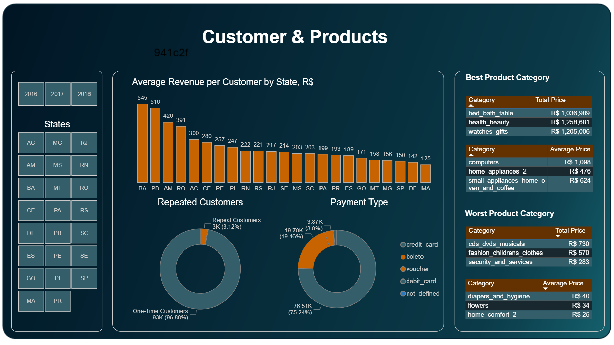
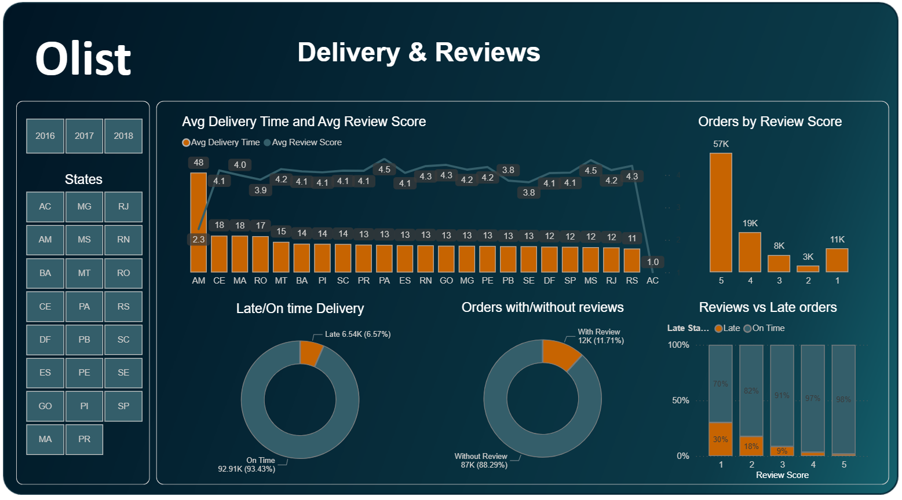
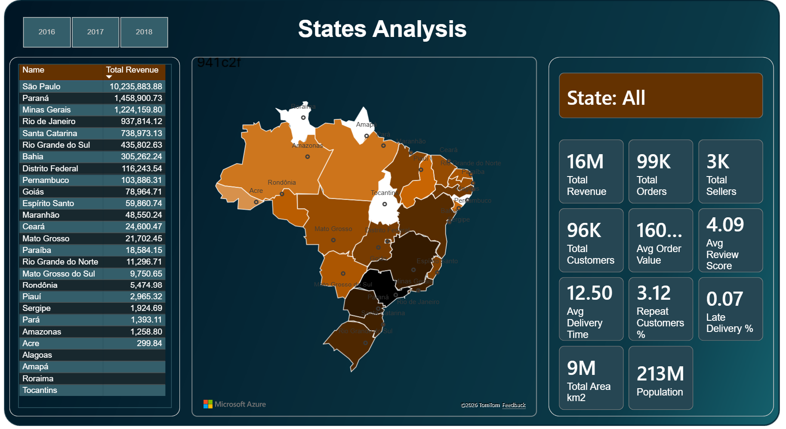

# 🛒 Olist Store Marketplace Analysis

## 📌 Project Overview

Olist is the largest eCommerce marketplace in Brazil, connecting thousands of small businesses to leading online sales channels through a single integrated platform. As the marketplace scaled rapidly, understanding **sales performance, customer behaviour, logistics efficiency, and customer satisfaction** became essential to support **sustainable growth**.

This project analyses the **Brazilian eCommerce public dataset (2016–2018)** using exploratory data analysis to uncover key business insights and deliver data-driven recommendations. The results are presented through an **interactive Power BI report**, designed to support business stakeholders with **clear and actionable visual insights** aimed at improving sales, delivery performance, and customer retention.

---

## 🎯 Task Description

The main objective of this project was to **analyse the dataset to extract meaningful business insights and propose data-driven recommendations**. Specifically, the analysis focused on:

- Analysing **sales trends and seasonality**
- Understanding **customer demographics and retention behaviour**
- Identifying **best- and worst-performing product categories**
- Evaluating **delivery performance** and its impact on **customer satisfaction**
- Exploring the **geographic distribution of revenue**
- Translating analytical findings into **actionable business recommendations**

---

## 🗂 Dataset Description

The dataset contains information on approximately **100,000 orders** placed between **October 2016 and September 2018** across multiple Brazilian marketplaces.

- **Customers** – customer ID and location (city, state, zip code)
- **Sellers** – seller ID and location
- **Products** – product ID and category
- **Orders** – order and customer IDs, order lifecycle dates, and order status
- **Order Items** – item-level pricing, freight cost, seller and product IDs
- **Payments** – order ID, payment method, instalments, and payment value
- **Reviews** – order ID, review score (1–5), review title, and review message
- **Geolocation** – geographic coordinates by zip code

This data model enables analysis across **time, geography, products, customers, logistics, and customer satisfaction**.

---

## 📊 Dashboard Pages & Key Insights

### 1️⃣ Executive Overview & Sales Trends

  

This page provides a **high-level overview of Olist’s commercial performance**, highlighting sales scale, growth trends, customer satisfaction, and delivery efficiency and sets the context for deeper analysis.

- Olist generated approximately **R$16M in total revenue** from **~99K orders**, supported by **~3K sellers** and **~96K customers**.
- The **average order value (AOV)** is approximately **R$160**, indicating a mid-range eCommerce basket size.
- **2017 experienced exceptional growth** (+529% from January to December), reflecting rapid marketplace expansion.  
  This was followed by **stagnation in 2018**, with a **~9% decline from January to August**.
- The revenue forecast included in the dashboard suggests **potential future growth**, assuming current trends and seasonality continue.
- A **clear weekday effect** is observed: revenue is consistently **higher on weekdays (Monday–Friday)** and lower on **weekends (Saturday–Sunday)**.
- Customer satisfaction remains strong with an **average review score of ~4.09**, despite a relatively long **average delivery time of ~12.5 days**.
- Approximately **6.6% of orders are delivered late**, making delivery performance a key area for improving the overall customer experience.

Since full-year data is not available for 2016 or 2018, the monthly revenue bar chart is filtered to **2017** and highlights **revenue seasonality**, with **January as the weakest month** and **November as the strongest**.

  

To better understand the drivers behind the strong November performance in 2017, the analysis drills down to the daily level. This reveals a clear spike on **24 November 2017 (Black Friday)**, when Olist generated **R$178,378 in revenue in a single day**, compared to a **2017 daily average of ~R$19,562**. This demonstrates how much **customer demand increases** when strong discounts are offered.

  

### 2️⃣ Products, Customers & Payments

  

This page focuses on **customer behaviour, product performance, and payment preferences**, highlighting how revenue is distributed across regions, categories, and purchasing patterns.

- There is **significant variation in average revenue per customer by state**, indicating uneven customer value across regions and suggesting the need for region-specific commercial and marketing strategies.
- **One-time customers dominate the platform (~97%)**, while repeat customers represent only a small share (~3%), highlighting a clear opportunity for improving customer retention.
- **Credit cards are the primary payment method (~75%)**, followed by **boleto (~19%)**.
- Revenue shows **significant variation across product categories**, with clear differences between top- and bottom-performing categories.
- Several **categories** (e.g. computers, home appliances) shows **high average prices but low order volume**, suggesting margin potential but limited demand.
### 3️⃣ Delivery Performance & Customer Reviews

  

This page examines **delivery performance and customer feedback**, highlighting how logistics efficiency influences customer satisfaction across regions and order outcomes.

- Average delivery time is similar across most states, with **Amazonas standing out** due to significantly longer delivery times.
- While most orders are delivered on time, approximately **6.6% of orders are delivered late**.
- Late deliveries are more commonly seen in low-rated orders, whereas higher review scores are mostly linked to on-time deliveries.
- Customer satisfaction is generally positive, with **5-star reviews representing the largest share** of submitted ratings.
- Only a **small proportion of orders receive reviews**, suggesting a clear need to encourage more customers to share feedback.
### 4️⃣ Geographic Distribution & Regional Performance

  

This page explores the **geographic distribution of revenue across Brazil**, highlighting regional differences in sales contribution and overall marketplace footprint.

- Revenue is **unevenly distributed across states**, with clear differences in total sales contribution by region.
- **São Paulo stands out as the largest revenue contributor**, reflecting its population size, economic strength, and high marketplace adoption.
- A second tier of states (e.g. Paraná, Minas Gerais, Rio de Janeiro, Santa Catarina, Rio Grande do Sul) also generate substantial revenue, though at significantly lower levels than São Paulo.
- Several states contribute relatively small shares of total revenue, suggesting opportunities for targeted growth or highlighting possible structural market constraints.

The map and accompanying table highlight **total revenue by state**, making it easier to identify regional concentration and underpenetrated markets.

Drilling into individual states allows comparison of **key performance indicators** such as revenue, order volume, average order value, and delivery performance, supporting more localised commercial and operational strategies.

## 💡 Business Recommendations

Based on the analysis, the following actions could support sustainable marketplace growth:

1. **Expand seller coverage in underpenetrated western states**  
   Several western states currently have **no sellers or only one active seller**, limiting customer choice and revenue potential. Targeted seller acquisition in these regions could improve geographic coverage and unlock new demand.

2. **Increase customer retention initiatives**  
   With ~97% of customers making only a single purchase, introducing loyalty programs, post-purchase incentives, and personalized recommendations could significantly improve repeat purchase rates and lifetime value.

3. **Strengthen category-level marketing strategies**  
   Additional marketing investment in selected product categories could improve performance.  
   Implementing **cross-selling or bundling strategies**—for example, pairing high-performing products with underperforming ones—may help increase exposure and overall basket value.

4. **Leverage promotional success beyond Black Friday**  
   Given the strong revenue spike observed during Black Friday, similar promotional campaigns could be introduced during **weaker sales periods**, such as January, to reduce seasonality and stabilize revenue throughout the year.

5. **Improve logistics performance in outlier regions**  
   Delivery delays in regions such as Amazonas have a visible impact on customer satisfaction. Improving logistics partnerships or adjusting delivery expectations in these regions could help protect review scores and customer trust.

6. **Increase customer review participation**  
   Since only a small share of customers leave reviews, encouraging feedback through reminders or incentives would provide more representative insights into customer satisfaction and service quality.

